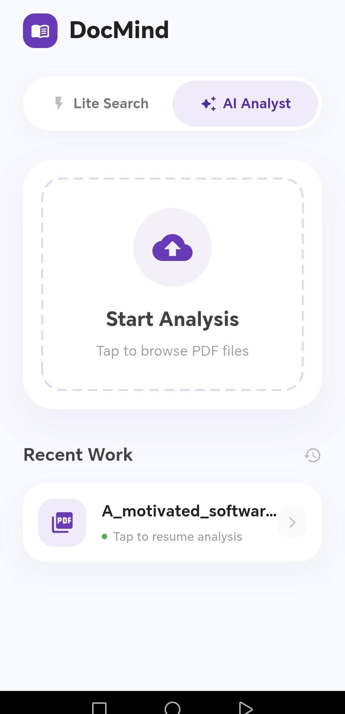
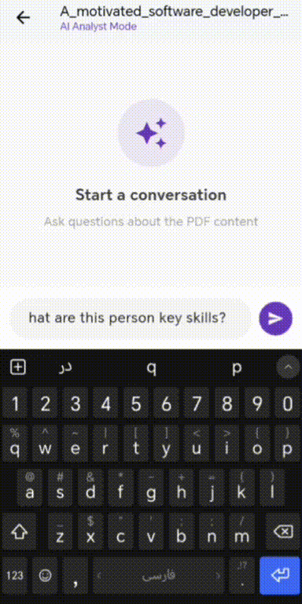
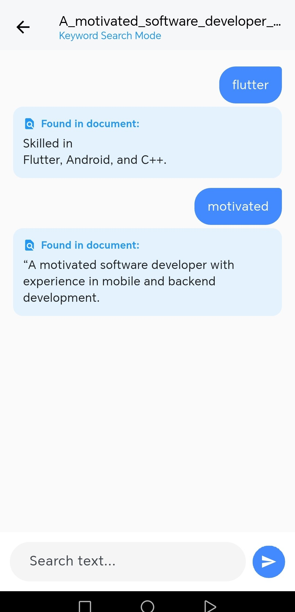

# 🧠 DocMind: AI-Powered Offline Document Analyst

<div align="center">


</div>

---

**DocMind** is a mobile application for analyzing PDF documents using an offline AI assistant.  
It allows users to chat with documents, search content, and extract information without sending any data to external servers.

All AI processing is performed **locally on the device** after a one-time model download.

---

## 📸 Demo & Screenshots

<div align="center">
  <table style="border: none; text-align: center;">
    <tr>
      <td width="32%" style="border: none;">
        <h3 align="center">🏠 Home</h3>
        
      </td>
      <td width="32%" style="border: none;">
        <h3 align="center">🤖 AI Chat</h3>
        
      </td>
      <td width="32%" style="border: none;">
        <h3 align="center">⚡ Lite Search</h3>
        
      </td>
    </tr>
  </table>
</div>

---

## 🚀 Key Features

### 🤖 1. AI Analyst Mode (Offline / On-Device)
- Uses a quantized **Qwen 0.5B** language model running fully on the device
- The model is executed locally using `llama.cpp` with a Dart FFI bridge
- Responses are generated token-by-token for a real-time chat experience
- PDF text is processed and truncated automatically to avoid memory issues on mobile devices

### ⚡ 2. Lite Search Mode
- Fast exact-match keyword search inside PDF documents
- Does not use AI, making it suitable for quick lookups
- Works instantly even on low-end devices

### 🔒 3. Offline & Privacy-Focused
- No internet connection required after the initial model download (~300MB)
- Documents are never uploaded or shared
- All AI inference runs on the device CPU

---

## 🛠️ Tech Stack & Architecture

The project follows a layered structure inspired by **Clean Architecture**, with business logic organized using the **BLoC** pattern.


- **UI Framework:** Flutter & Dart
- **State Management:** BLoC / Cubit
- **AI Engine:** `llama.cpp` (C++)
- **FFI Bridge:** `llama_cpp_dart`
- **PDF Parsing:** Local text extraction
- **Storage:** Device local storage

---
---

## 📦 Dependencies

| Package | Version | Purpose |
|-------|---------|---------|
| flutter_bloc | ^9.1.1 | State management (BLoC pattern) |
| equatable | ^2.0.7 | Efficient state comparison |
| file_picker | ^10.3.8 | Selecting PDF files |
| dotted_border | ^2.1.0 | UI decoration |
| permission_handler | ^12.0.1 | Runtime permissions |
| syncfusion_flutter_pdf | ^32.1.20 | PDF text extraction |
| dio | ^5.9.0 | Model download & networking |
| path_provider | ^2.1.5 | Local file paths |
| llama_cpp_dart | ^0.1.2+1 | On-device LLM (FFI bridge) |
| shared_preferences | ^2.5.4 | Local settings storage |


## 📂 Project Structure

```bash
lib/
├── data/
│   ├── services/
│   │   ├── download_service.dart   # Handles model download and storage
│   │   ├── llm_service.dart        # On-device AI inference logic
│   │   └── pdf_service.dart        # PDF text extraction
│   └── models/
├── logic/
│   ├── home_bloc/                  # File selection & model availability
│   │   ├── home_bloc.dart
│   │   ├── home_event.dart
│   │   └── home_state.dart
│   └── lite/                       # Chat & search logic
│       ├── chat_bloc.dart
│       ├── chat_event.dart
│       └── chat_state.dart
├── presentation/
│   ├── screens/
│       ├── home_screen.dart
│       └── chat_screen.dart

└── main.dart
```
## ⚙️ Performance & Configuration

Default settings are chosen to ensure stable performance on most Android devices:

Context Size: 2048 tokens

Max Prediction: 256 tokens

Threads: 4

These values help prevent crashes on devices with limited memory.

Adjusting for High-End Devices
On devices with higher RAM (8GB+), settings can be adjusted in llm_service.dart:
```dart
_llama = Llama(
  modelPath,
  ModelParams(),
  ContextParams()
    ..nCtx = 4096
    ..nBatch = 512
    ..nPredict = -1,
);
```
## 📦 Getting Started
1. Clone the repository
```bash
git clone https://github.com/your-username/docmind.git
```
2. Install dependencies
```bash
flutter pub get
```

## 📱 Platform Support
Android ✅
iOS ⚠️ 